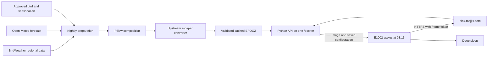

# Deployment plan: Denver bird-art frame

Decision date: October 7, 2026, America/Denver.

Status: original deployment specification. Implementation began October 8, 2026. See README.md and RUNBOOK.md for current state and owner operations; the steps below preserve the agreed design.

## Selected design

Use a pinned fork of ESP32 PhotoFrame on the E1002 and one small Docker service behind the existing Caddy proxy:



The frame pulls the image when its own timer wakes it. The service prepares images before that request; it does not remotely wake the frame. At 03:15 the image represents the upcoming local day, informed by recent regional bird activity and that day's forecast.

The first POC has no microphone, Raspberry Pi dependency, audio ingestion, or continuously running classifier. Later evidence sources fit a common adapter interface.

## Verified host integration

Read-only inspection found:

| Item | Observed state |
|---|---|
| SSH | `lstepnio@one.majjix.com` works using the existing key |
| Public hostname | `eink.majjix.com` resolves through `one.majjix.com` to `140.235.42.67`; no IPv6 answer was returned |
| Architecture | `x86_64`, so build a `linux/amd64` container |
| Compose | Existing stack at `/docker/docker-compose.yml`; Compose v5.5.1 |
| HTTPS proxy | `lucaslorentz/caddy-docker-proxy` publishes TCP 80/443 |
| Network | Existing Compose network key `caddy` maps to `docker_caddy` |
| Service convention | Caddy routing labels, `restart: unless-stopped`, bounded JSON logs, health checks, and bind mounts under `/docker/appdata` |
| Capacity snapshot | About 7.9 GiB RAM total and 5.0 GiB available; about 818 GiB disk available |
| Existing landing page | `one.majjix.com` and `majjix.com` already serve a Caddy static site |

This establishes a suitable integration path, not sustained capacity, uptime, or successful TLS issuance for the new service. Resource measurements are a point-in-time snapshot.

Add `einkartifact` under the existing Compose `services` map and attach it to `caddy`. Caddy labels specify `eink.majjix.com` and upstream port `8080`. The container does not publish another host port. Existing Caddy configuration can discover the new labels.

Use [deployment/compose-service.yml](deployment/compose-service.yml) as the service fragment. Build the image and create its persistent directories before starting it.

The existing `/docker/upgrade.containers.sh` exports configuration, commits/pushes a backup, pulls stack images, and updates the stack. For the POC, use a locally built versioned `einkartifact:poc-001` image with `pull_policy: never` so that routine maintenance does not attempt to fetch this private local image from Docker Hub. Application updates explicitly build/load a new versioned image and update only this service. [Compose pull policy](https://docs.docker.com/reference/compose-file/services/#pull_policy)

The proposed application data, configuration, and master-art paths are covered by the host's existing Git ignore rules. Extend the sanitized configuration export to include our nonsecret site configuration, art catalog/credits, and image-version manifest. The SQLite database, token hashes, and artwork need a separate consistent backup; a Compose Git commit alone does not recover them.

Proposed layout:

```text
/docker/appdata/einkartifact/
  source/                    versioned application checkout, including Dockerfile
  config/site.json           owner-edited nonsecret site and frame policy
  art/catalog.json           approved species, assets, seasons, and license metadata
  art/masters/               approved originals and compositing assets
  data/einkartifact.sqlite3  frame registry, token hashes, jobs, and observations
  data/cache/                immutable display files and owner previews
  data/provider-cache/       bounded regional and forecast responses

/docker/backups/einkartifact/
  <timestamp>/               consistent database backup, manifests, and configuration
```

Mount `config` and `art` read-only. Only `data` and bounded temporary storage are writable by the service. Use the existing UID/GID `1000:1000`. Artwork and configuration should be versioned or independently backed up; the application image is rebuildable.

Do not put frame tokens, Wi-Fi passwords, provider credentials, or unsanitized device exports into the source/config repository.

## Runtime and scope

The proposed runtime is Python with FastAPI, one Uvicorn worker, Pillow, SQLite, and a single background preparation worker. SQLite's WAL mode and a bounded busy timeout are adequate for the POC. Use supported, pinned dependencies and a pinned container base digest when building.

Run `@aitjcize/epaper-image-convert` as a short-lived Node process. Pin the initially researched `0.1.21` version after a build/conversion smoke test. Keep its native canvas runtime dependencies in the image, but keep build tools in a separate build stage. The package is MIT-licensed and already supports the panel palette and EPDGZ output. [Converter source and CLI](https://github.com/aitjcize/epaper-image-convert)

Pillow draws the approved composition and deterministic captions before conversion. There is no Chromium, HTML screenshot engine, Redis, separate database server, or cloud GPU in the core POC. Node is present for conversion, so the image is larger than a pure Python image server.

Provisional resource goals:

| Resource | Planning target |
|---|---|
| Idle container RAM | At most approximately 150 MiB |
| Hard memory limit | 512 MiB initially; adjust only after measuring conversion |
| CPU allocation | At most one CPU worth of runtime work |
| Conversion concurrency | One job at a time |
| Prepared-image response | Cached body begins within one second on the host |
| POC coverage | One Denver site and one frame; exercise two simulated frame identities |

These are acceptance targets, not benchmarks. A failed or killed converter must leave the old cache valid. Running a blocking converter on the API event loop would undermine this design; use a background worker and subprocess timeout.

For initial owner operations, provide a small CLI through SSH/`docker exec`: add a frame, rotate its token, set its schedule, prepare a preview, inspect status, and create a backup. The frame retains its upstream Wi-Fi/setup UI. A separate public owner dashboard is a later convenience.

The strongest alternative is the full PhotoFrame server, whose dashboard and management already exist. Choose it instead if maintaining the small owner CLI and registry becomes more burdensome than its additional runtime dependencies. Do not maintain both.

## Frame and HTTPS contract

Fork [ESP32 PhotoFrame v2.19.0](https://github.com/aitjcize/esp32-photoframe/releases/tag/v2.19.0), pinned to `186ebaf3b470305824d238c2d2dabf2c5bc59a7a`. Start with upstream firmware behavior; make changes only to demonstrated power, recovery, or gift-usability gaps.

Initial device settings:

| Setting | Value |
|---|---|
| Image URL | `https://eink.majjix.com/v1/image` |
| Authentication | Unique high-entropy bearer token per frame |
| Rotation mode | `url` |
| Automatic rotation | Enabled |
| Deep sleep | Enabled |
| Timezone | `MST7MDT,M3.2.0,M11.1.0` |
| Rotation cron | `["15 3 *"]`, upstream three-field format |
| Output | Native 800×480 EPDGZ, using the approved panel profile |

The server uses `America/Denver`; the firmware uses the POSIX timezone above. Local daily scheduling gives 23-hour and 25-hour gaps around DST. The retained settings from the previous successful configuration remain the fallback during a cloud outage.

Proposed endpoints:

| Endpoint | Purpose |
|---|---|
| `GET /` | Minimal service information and provider/art attribution |
| `GET /healthz` | Process/database readiness; no private device details |
| `GET /v1/image` | Authenticated cached image and optional configuration |

The bearer token determines frame identity, never a token in the URL. Store token hashes and issue the plaintext token once. A token only grants access to that frame's image. Validate advertised geometry against the registered profile; reject incompatible requests clearly rather than returning another panel's data.

The image request path authenticates, records nonsecret telemetry, reads the active cache manifest, and streams the file. It makes no provider request and starts no rendering. Return `401` for invalid credentials and `503` if there is no validated bootstrap or active image.

Response:

```http
HTTP/1.1 200 OK
Content-Type: application/octet-stream
Content-Length: <exact EPDGZ byte count>
Cache-Control: private, no-cache
ETag: "<body-hash-and-config-revision>"
X-Config-Payload: {"config":{"timezone":"MST7MDT,M3.2.0,M11.1.0","auto_rotate":true,"rotate_cron":["15 3 *"],"rotation_mode":"url","deep_sleep_enabled":true}}
```

EPDGZ is a gzip-based application format; do not add HTTP `Content-Encoding: gzip` or double-compress it through the proxy. If needed, return the upstream thumbnail URL header pointing to an authenticated cached preview; test its wake-time impact before enabling it.

An ETag includes both the prepared body hash and the desired configuration revision. The inspected firmware skips configuration application on `304`, so any configuration change requires `200` with the image even when the artwork bytes are identical. Use `304` only after receiving a matching `If-None-Match` and with no pending configuration change. [Firmware protocol](https://github.com/aitjcize/esp32-photoframe/blob/186ebaf3b470305824d238c2d2dabf2c5bc59a7a/docs/API.md)

Configuration pushes are an allowlist of schedule, sleep, orientation, and approved processing fields. Keep the header below the inspected firmware's approximately 2 KiB payload buffer. Do not let provider data set device configuration. The server owns these selected policy fields; Wi-Fi and local setup credentials remain local.

Record reported battery, firmware, previous ETag, last contact, and last served image. A successful HTTP response proves delivery to the HTTP client, not physical panel output. The next request echoing the previous validator provides additional evidence because upstream persists it after successful display.

Validate the ESP32's certificate trust with Caddy's issued chain and a renewal test. Keep certificate verification enabled. Provision any required CA while the frame is awake; do not assume a URL working in a desktop browser proves firmware TLS compatibility.

## Nightly preparation and recovery

Default local schedule:

1. At 02:30, determine the target Denver calendar date and claim a persisted preparation job.
2. Fetch one regional bird snapshot and one forecast per site. Bound each request and use limited retries before 03:00.
3. Select an eligible approved species and composition using recent evidence, season, preferences, and a seven-day repeat penalty.
4. Compose the upcoming day's weather cues, optional bird name, and optional dated outlook.
5. Convert, validate, and write an immutable EPDGZ file plus preview.
6. Commit the active image reference atomically, with a goal of finishing before 03:00.
7. The frame fetches at 03:15, displays, and returns to deep sleep.

A 60-second scheduler check is sufficient. Persist uniqueness by frame, target date, and render revision. On restart, reclaim interrupted jobs and prepare missing output. Run one application worker so scheduling is not duplicated by several Uvicorn workers.

Selection and preparation use a saved seed and input snapshot. Serving an image never advances the art rotation. A deliberate owner regeneration creates a new revision. Preserve the current file until validation and the database transaction complete; remove abandoned temporary files on startup.

Validate dimensions, orientation, file size limits, decompression, and valid panel color indices against the pinned converter/firmware format. Use content hashes. Apply a conversion timeout and reject an incomplete result. Browser previews are useful, but physical panel review decides art quality.

If a provider fails, use a recent usable snapshot or the seasonally eligible approved catalog. If the forecast is unavailable or belongs to a different date, omit forecast cues/text and render neutral seasonal art. If preparation itself fails, continue serving the last good image; any weather caption on it must show its original date.

A server restart or late preparation cannot wake the sleeping frame. A missed nightly download keeps yesterday's image until the next timer or manual button wake. Verify that a button wake does not shift the normal nightly slot.

## Online data and artwork

Use BirdWeather's `topBirdnetSpecies` GraphQL query with an explicit bounded time window and a configurable Denver bounding box. Anonymous regional access worked in the saved live test; it has no established availability or unlimited-use guarantee. Request a capped species list once daily per site and cache the response. Counts represent acoustic detection events, not individual birds or a backyard census. [BirdWeather API](https://app.birdweather.com/api/index.html)

The proposed Denver box is southwest `39.45,-105.30` to northeast `40.05,-104.55`. It is regional and can be narrowed later. Match evidence to our catalog by scientific name plus a versioned provider-ID mapping. Ignore unknown, unsupported, or seasonally implausible entries rather than generating unreviewed art.

eBird remains an optional complementary adapter after obtaining a personal API key. A curated catalog is always the final fallback. Missing observations do not prove absence.

For Open-Meteo, use approximate Denver center `39.7392,-104.9903` and `timezone=America/Denver`. Request the target local date, with daily `weather_code`, `temperature_2m_min`, `temperature_2m_max`, `precipitation_probability_max`, `snowfall_sum`, and `wind_speed_10m_max`. Verify the returned date and units. Daily weather code summarizes the day's most severe condition, so present cues as an outlook rather than an all-day promise. [Forecast API](https://open-meteo.com/en/docs)

The free weather endpoint is intended for noncommercial use and requires attribution. Put provider and art credits on the service information page and include them in the gift documentation; verify the precise terms during implementation. [Access and pricing](https://open-meteo.com/en/pricing)

Start with 6 to 10 verified Denver species and 12 to 20 approved compositions, including useful year-round fallbacks. Species-month eligibility is catalog data, reviewed before gift release. Pick one art direction, then physically compare palette/processing presets.

Prefer approved master compositions and layered seasonal/weather assets. Draw captions with real fonts after art creation. Weather effects should be restrained and should not obscure identification features. Avoid using forecast temperature alone to imply that snow is on the ground.

Two artwork modes can share the same service:

| Mode | Behavior and tradeoff |
|---|---|
| Approved library, selected for POC | Personalize a nightly composition from reviewed assets, season, regional birds, and fresh weather. Predictable quality and no per-day generation bill. |
| Optional online generation | Prepare a fresh illustration before the wake, with a configured provider, API key, spending cap, timeout, and approved-library fallback. More visual variation, but species errors, composition drift, and recurring charges require evaluation. |

The initial POC uses the first mode. Fresh daily composition does not require fresh paid generative art. Online generation can later fill a review queue or run as a deliberately enabled experiment; it never runs during a frame fetch.

## Data model and multi-frame extension

Keep a small schema:

- `sites`: timezone, coarse weather location, bird-region bounds, preferences.
- `frames`: site, token hash, schedule/config revision, render profile, reported battery, contact and served-image metadata.
- `evidence_snapshots`: provider, geographic/time bounds, received time, normalized species records.
- `artworks`: species, allowed months/habitat, assets, style, approval and license/credit information.
- `daily_images`: frame/date/revision, selected artwork, evidence/forecast provenance, file hash, status, and active cache reference.
- `jobs`: preparation claims, attempts, deadlines, and last error.

Frame geometry, orientation, and calibration are explicit rendering inputs. Nearby frames share provider snapshots and can share an output only when art selection and render profiles match. Several frames at the same site can still have different styles or schedules.

Add future local BirdNET metadata through a scoped detector endpoint when that stage begins. Audio and classification stay outside the core frame service. The evidence abstraction is sufficient flexibility for now; do not prebuild a plugin system or audio queue.

## Costs, monitoring, and backups

No new hosting subscription or microphone purchase is needed for the selected POC. Expected incremental cash cost is near zero on the existing host, apart from a chosen one-time art budget. This assumes current capacity and noncommercial provider access remain suitable.

At an illustrative 300 KB daily transfer, one frame uses approximately 9 MB/month. Actual EPDGZ size and retries need measurement. Provider fetches are shared per site. A 512 MiB limit and one-at-a-time conversion keep the footprint bounded; they do not establish performance.

Use bounded structured logs and avoid logging Authorization, full device configuration, or personal coordinates more precise than needed. Retain a manageable set of previews, output revisions, provider snapshots, and errors; keep a last-good and a bootstrap image regardless of age-based cleanup.

Health separates container readiness from content freshness. `/healthz` can remain healthy during a provider outage if cached art can be served. Owner status should flag a missing nightly image after 03:00 and no frame contact for more than 36 hours. An HTTP monitor cannot detect a frame that stopped contacting an otherwise healthy server.

Use the existing monitoring tools where practical. No notification channel needs configuring during this planning step. Battery percentage is a hint, not a measured runtime guarantee.

Create a nightly SQLite online backup, not a naked copy of a WAL database. Save it with manifests/config and tested artwork recovery, then include it in the host's existing independent backup process. Files under `/docker/backups` alone are not independent protection from host/disk loss.

Before schema changes, keep a consistent backup and record the prior image ID. Prefer additive migrations for the POC. Do not assume downgrading the container also downgrades the database.

## Implementation and rollout order

| Stage | Concrete deliverable | Gate |
|---|---|---|
| 1. Firmware baseline | Create pinned fork, retain recovery image, inspect installed board/firmware, test three artworks and scheduled battery wake | Physical display and wake confirmed |
| 2. Local service | Implement cached authenticated endpoint, registry/CLI, bootstrap image, configuration and ETag behavior | Two-frame isolation, invalid token, 200/304/config-change tests pass |
| 3. Preparation | Add BirdWeather, weather, deterministic selection, Pillow composition, converter, atomic publication and restart recovery | Provider failures, corrupt output, and reruns preserve a stable good image |
| 4. Container | Build a pinned `linux/amd64` image; run with the draft limits/mounts; capture memory and response measurements | Native converter works without Chromium; readiness and restart behavior verified |
| 5. Host integration | Back up Compose, create directories, add only the new service, validate resolved Compose, start only `einkartifact` | Caddy HTTPS route and existing host services remain healthy |
| 6. Remote frame | Provision token and HTTPS URL while awake; run a manual download and the nightly schedule on recipient-like Wi-Fi | Physical image, configuration persistence, TLS, and timer wake confirmed |
| 7. Gift release | Exercise outages, DST, renewal, slow transfers, buttons, charging, and a 7 to 14-day unattended soak | Recorded power/quality evidence supports the agreed charging target |

Planned host commands, after the application and image exist:

```sh
docker compose -f /docker/docker-compose.yml config --quiet
docker compose -f /docker/docker-compose.yml up -d --no-deps einkartifact
docker compose -f /docker/docker-compose.yml ps einkartifact
```

Build or load the versioned image before starting the service, and record its image ID. Caddy should discover the routing labels; inspect the resulting route and TLS before considering deployment successful.

Rollback switches only this service to the previous image and compatible data snapshot. For first deployment, remove only its Compose entry/container after backing up its data; Caddy can remove the discovered route. Preserve data for investigation and avoid a stack-wide `down` or unrelated container restart.

The three-month charging target remains an acceptance goal requiring battery-side measurement. Firmware compilation, container health, and a correct HTTP response do not prove sleep current, physical artwork, or 90-day runtime.

Planning validation: the draft service fragment parsed successfully using the host's actual Compose version, wrapped with the existing network name. This was a read-only configuration check; it did not start a container or establish runtime compatibility.

## Decision assessment

**Bottom line:** One small Docker application on the existing host, plus the pinned firmware fork, is the selected POC.

**Key strengths:** Matches current infrastructure, serves precomputed images quickly, avoids continuous hardware, shares data across frames, and has a predictable cost floor.

**Key weaknesses:** We own a modest amount of service code; reviewed art takes effort; remote providers and the shared host can fail; battery life remains unmeasured.

**Strongest counterargument:** The full upstream server may save more development time than a custom smaller runtime saves resources. Revisit that choice if owner-management features grow.

**Better approach for this scope:** Keep the custom service deliberately narrow, reuse the firmware and converter, and defer daily AI generation, a new dashboard, and microphones.

**Confidence:** High in the host integration and core architecture; moderate in converter memory, firmware provisioning, and battery performance until measured. Scope growth or poor physical artwork would justify revisiting the design.
