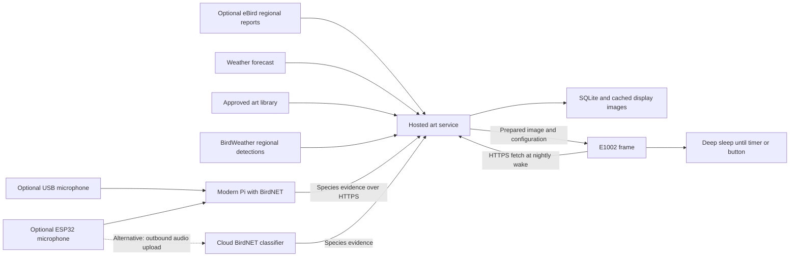

# Denver bird-art frame: architecture and POC plan

Planning date: October 7, 2026, America/Denver.

## Recommendation

Use the E1002 as a sleeping image client, with a small hosted service preparing its artwork. Start with curated Colorado bird art, seasonal eligibility, regional BirdWeather detections or eBird reports, and understated weather cues. Add actual backyard listening as a separate input once the frame and visual pipeline work reliably.

Preferred implementation bases:

- Frame: a pinned fork of [ESP32 PhotoFrame](https://github.com/aitjcize/esp32-photoframe), initially with upstream behavior.
- Service: one purpose-built Python container at `emviary.majjix.com` on `one.majjix.com`, integrated into the existing `/docker` Compose stack and Caddy network.
- Image conversion: reuse the MIT-licensed [epaper-image-convert](https://github.com/aitjcize/epaper-image-convert) library as a short-lived conversion process.
- Optional detection: the available modern Raspberry Pi running [BirdNET-Go](https://github.com/tphakala/birdnet-go), with a USB microphone first. Add a separate ESP32 microphone when it materially improves microphone placement.
- Cloud classification remains a supported alternative. It requires a different audio transport and a measured compute budget, but the frame does not need to change.

The core design is flexible because the art service consumes a small common bird-evidence record. It does not depend on a particular microphone, classifier, or regional data provider.

The user selected the hostname and host and asked to finalize the deployment plan before implementation. [DEPLOYMENT.md](DEPLOYMENT.md) specifies the chosen runtime, host integration, API, nightly workflow, and rollout. The broader PhotoFrame server remains an alternative if its ready-made dashboard becomes more valuable than a smaller runtime.

## Confirmed requirements and assumptions

| Item | Decision or status |
|---|---|
| Display | User already owns a reTerminal E1002 |
| Recipient region | Denver area |
| Connectivity | Reliable Wi-Fi; device requires 2.4 GHz |
| Refresh | Usually once nightly; proposed default 03:15 Denver time |
| Battery | Three months between charges is a preferred target, with flexibility for better results |
| Hosting | `emviary.majjix.com` on `one.majjix.com` using the existing `/docker` patterns |
| Other hardware | An older Pi and a modern, possibly current Pi are available; exact models remain unverified |
| Additional purchases | Acceptable when they improve results |
| Scope now | A researched, implementable plan; physical and deployed behavior remain unverified |

The E1002 is an ESP32-S3 device with a 7.3-inch, 800×480, six-color display and a 2000 mAh battery. Its panel retains an image while the electronics sleep. Actual battery life depends on the whole board and wake workload, not only the ESP32's advertised sleep current. [Seeed hardware documentation](https://wiki.seeedstudio.com/getting_started_with_reterminal_e1002/)

Prior project notes record an ESP32 PhotoFrame v2.18.0 installation and a roughly 33-second physical refresh under earlier factory firmware. Those are historical observations, not a current device inspection. Recheck the installed firmware, board revision, wake behavior, and physical panel before making changes.

## Architecture



One hosted application and its persistent data directory are enough for the core POC. Use the verified existing Caddy Docker proxy and `docker_caddy` network. Keep SQLite, master artwork, converted images, and backups in persistent storage. An in-process scheduled job can prepare images; serialize conversion and keep it off the request-serving event loop.

Start with one site and one frame. A site owns regional settings and optional detectors; several frames can reference the same site and share approved art. Each frame has its own token, schedule, orientation, and processing profile.

No persistent network connection is needed on the frame. A remote setting change takes effect on its next wake. An ordinary Wi-Fi cloud message cannot wake an ESP32 in deep sleep.

## Existing firmware and projects

| Candidate | Useful existing behavior | Main limitation for this gift | Decision |
|---|---|---|---|
| ESP32 PhotoFrame | E1002 support, color processing, URL downloads, local setup/UI, scheduled sleep, configuration in image responses | More features than needed; measure awake time and power on this unit | Preferred firmware base |
| Frans-Willem epd-photoframe | Small wake/download/display/sleep loop; response `Refresh` interval controls next wake | Current setup accepts HTTP only; no clear top-level license was found in the inspected checkout | Useful reference, especially for power and scheduling |
| FrameOS | Scene engine and device-management platform; E1002 preset | Its E1002 page explicitly says physical hardware support is not yet confirmed | Revisit for broader interactive scenes |
| ESPHome | Documented Seeed display support and flexible configuration | We would assemble more of the image-client behavior ourselves | Reasonable alternative if Home Assistant is central |
| TRMNL | Existing dashboard and device ecosystem | Seeed documents monochrome rendering on E1002 | Poor fit for the intended color artwork |
| SenseCraft | Fast vendor-managed baseline | Less control over the specific hosted service and firmware behavior | Keep as a recovery/reference option |

Sources: [PhotoFrame](https://github.com/aitjcize/esp32-photoframe), [epd-photoframe](https://github.com/Frans-Willem/epd-photoframe), [FrameOS E1002 status](https://frameos.net/devices/seeed-reterminal-e1002/), [Seeed ESPHome](https://wiki.seeedstudio.com/reterminal_e10xx_with_esphome/), [Seeed TRMNL](https://wiki.seeedstudio.com/xiao_7_5_inch_epaper_panel_with_trmnl/).

The current PhotoFrame release verified during research was [v2.19.0](https://github.com/aitjcize/esp32-photoframe/releases/tag/v2.19.0), published October 5, 2026. It includes relevant fixes for failed downloads, network battery drain, ETag handling, RTC time, and DST scheduling. Pin this version for the initial evaluation instead of following an unversioned latest build.

Inspected source revisions:

| Repository | Revision |
|---|---|
| aitjcize/esp32-photoframe | `186ebaf3b470305824d238c2d2dabf2c5bc59a7a`, v2.19.0 |
| aitjcize/esp32-photoframe-server | `065bfe790f57f69b36a3bc1414be085e2b6c1587`, source identifies v1.17.2 |
| Frans-Willem/epd-photoframe | `8a6fff382278919fd1541234732814085e86fb9c` |

PhotoFrame has a top-level MIT license; retain applicable inherited driver and dependency notices. The server README describes MIT licensing, but a root LICENSE file was absent from this checkout. Resolve that documentation gap before distributing a modified server package. Research clones were temporary; no remote forks have been created.

## Reuse and customization boundary

Forking does not require rewriting firmware. The stock image-response configuration can already persist a nightly schedule from the last successful wake.

Keep the firmware fork initially identical to the pinned upstream build. Potential later changes should be driven by measured gaps: a stricter total wake deadline, gift-oriented button behavior, a force-sleep option while externally powered, or an arbitrary one-shot next-wake timestamp.

Build a small service with four focused responsibilities:

1. A bird-art source that selects approved artwork using seasonal and observation evidence.
2. A daily image record and cache, so retries and repeated requests return the same image for the same frame/day.
3. Cloud enrollment and configuration that operate entirely through outbound frame requests.
4. Optional detector ingestion using a common evidence schema.

Reuse the existing firmware protocol and converter. Implement token isolation and a small SQLite frame/site registry. For the POC, use owner commands over SSH and the existing frame setup UI; an additional public administration dashboard can wait.

The upstream server uses Go, SQLite, and a Node-based e-paper converter. Its Docker image also contains Chromium for overlays, so it is larger than the selected POC needs. The selected service uses Pillow for deterministic composition and the upstream Node converter for final panel data, with no browser renderer. Measure actual idle and conversion memory rather than assuming that “small” means negligible. [Upstream server source](https://github.com/aitjcize/esp32-photoframe-server/blob/065bfe790f57f69b36a3bc1414be085e2b6c1587/Dockerfile)

The strongest reason to use the full upstream server is its ready-made owner interface. Reconsider it if maintaining our small registry and command interface becomes more work than retaining its broader features. Do not operate both servers for the same frame.

## Nightly wake and configuration behavior

Proposed normal cycle:

1. Cloud starts preparing regional evidence and the upcoming daytime forecast at 02:30 local time, with bounded retries before 03:00.
2. Cloud selects and renders the day's image, validates it, and publishes the cache atomically.
3. At 03:15, the frame cold-boots from deep sleep, reconnects, and fetches the prepared image over HTTPS.
4. It receives any pending configuration, displays the image, and records the successful image validator.
5. It turns off the radio and relevant peripherals, then sleeps until the next scheduled wake.

Use Denver local wall-clock scheduling. This gives one update each night; DST transitions produce a 23-hour or 25-hour interval. A fixed 86,400-second timer gives different behavior. The proposed 03:15 time avoids the repeated or missing 02:00 hour.

Illustrative upstream response configuration:

```http
HTTP/1.1 200 OK
Content-Type: application/octet-stream
ETag: "art-content-and-config-revision"
X-Config-Payload: {"config":{"timezone":"MST7MDT,M3.2.0,M11.1.0","auto_rotate":true,"rotate_cron":["15 3 *"],"rotation_mode":"url","deep_sleep_enabled":true}}
```

The body is the prepared EPDGZ image. The firmware uses a simplified three-field cron format: minute, hour, day of week. Keep pushed configuration small and restricted to validated fields. [PhotoFrame API](https://github.com/aitjcize/esp32-photoframe/blob/186ebaf3b470305824d238c2d2dabf2c5bc59a7a/docs/API.md)

Important implementation detail: the inspected firmware returns early on `304 Not Modified` before applying configuration. Include the configuration revision in the response validator and return `200` whenever a setting must change. Use `304` only when both artwork and relevant configuration are unchanged. [Fetch implementation](https://github.com/aitjcize/esp32-photoframe/blob/186ebaf3b470305824d238c2d2dabf2c5bc59a7a/main/utils.c)

The selected service uses only outbound frame requests and does not store a LAN address for remote configuration pulls. Complete initial token and endpoint provisioning while the frame is awake. If the full upstream server is used later, leave the remote frame host empty; its inspected code skips reverse configuration pulls for such devices. [Upstream server configuration sync](https://github.com/aitjcize/esp32-photoframe-server/blob/065bfe790f57f69b36a3bc1414be085e2b6c1587/backend/internal/handler/image.go)

An arbitrary server-supplied next-wake timestamp is an optional extension. If implemented, validate its range, subtract time spent awake, persist a safe schedule fallback, and keep button refreshes from shifting the normal nightly slot. The POC does not need this extension to deliver once-nightly updates.

## Failure behavior and gift usability

- A failed network request preserves the artwork already on the panel.
- Rendering and provider calls happen before the wake, outside the frame's request path.
- If cloud rendering fails, retain the last approved cached art. Weather text must carry its date; never represent stale weather as a live forecast.
- Validate image size, format, orientation, and content before publishing. Commit the cache only after validation.
- Bound connection attempts and verify total awake time under slow and unavailable networks. Existing socket timeouts are not a complete bound on a slow transfer that keeps producing data.
- Store scheduling and connection settings durably. Deep sleep restarts normal execution; ordinary RAM is not a persistent settings store.
- Use a unique frame token over validated TLS. Detector tokens have separate write scope. Keep provider keys on the server.
- Test certificate renewal, power loss, and RTC/SNTP recovery before gifting. Do not solve TLS problems by disabling verification.
- The recipient should only need Wi-Fi setup, charging, and an optional manual refresh. Advanced settings belong in the owner's dashboard.
- Review button mappings before gifting: the default firmware exposes functions such as clear/setup that may not match the desired gift experience.
- The server can report last contact and last served image. A request succeeding is not proof the new image reached the physical panel. The next request's previous-image ETag is useful evidence, but first installation and visual quality still need physical confirmation.
- Keep a small local approved art album for an explicit offline mode and bootstrap image. Do not replace good artwork with diagnostic screens on routine failures.

## Artwork and selection

Begin with 6 to 10 birds and roughly 12 to 20 approved compositions. Expand only after physical display review establishes a good style. A larger library improves diversity, but hundreds of unreviewed generations would add work without proving quality.

Useful Denver starting candidates include Black-capped Chickadee, Northern Flicker, American Robin, Blue Jay, Dark-eyed Junco, American Kestrel, Red-tailed Hawk, and Broad-tailed Hummingbird. Denver Audubon lists these among local resident and migratory birds. Month-by-month eligibility still needs verification; a local species list alone does not establish that every species belongs in every season. [Common Birds of Denver](https://www.denveraudubon.org/commonbirdsofdenver)

Choose one coherent art direction: woodblock-inspired landscape, botanical illustration, or restrained watercolor. Use clear silhouettes, sufficient contrast, and generous backgrounds. Keep the bird's diagnostic anatomy and plumage accurate. Add season and weather through background motifs rather than modifying species characteristics.

Examples of proposed visual treatment:

| Context | Treatment |
|---|---|
| Winter | Sparse branches, restrained snow, warmer bird contrast |
| Spring | Buds and emerging foliage |
| Summer | Grasses, wildflowers, open light |
| Autumn | Dry grasses, selected warm foliage |
| Rain forecast | A subtle cloud band or a few fine rain marks |
| Snow forecast | Sparse flakes or distant pale ground |
| Wind forecast | Angled grasses or a drifting leaf |

Select only approved compositions with appropriate species, habitat, and season. Recent local detections can receive priority; regional reports broaden the pool; the curated seasonal catalog is the final fallback. Apply a repeat penalty over the previous seven days, with exceptions for a small starting library. Make selection deterministic for each frame/day so retries do not advance the gallery.

Do not generate a new image on every wake or audio detection. Generate or commission art in batches, review it, and reuse it. Optional future generation should enter a review queue with a fixed spending limit.

Render seasonal/weather elements and any text onto the high-quality master, then perform the final palette conversion once. Use the measured Spectra 6 palette and compare at least two processing settings on the physical panel. Keep both the master and converted result. [Upstream converter](https://github.com/aitjcize/epaper-image-convert)

EPDGZ is preferable for the preferred firmware because it contains prepared panel data and avoids repeated on-device dithering. Start with a compatible PNG if necessary for the first visual test, then benchmark EPDGZ. Preserve native 800×480 panel geometry and test mounted orientation and mat clearance.

If captions are used, draw them deterministically after artwork creation. Keep the default art-dominant. A small bird name and dated morning outlook are optional; a persistent weather dashboard is a different product.

## Regional data and evidence quality

Start with the verified no-key BirdWeather regional query. Add eBird recent observations when a personal key is available, using an approximate Denver-area location, a proposed 25 km radius, and a 14-day lookback. Verify endpoint parameters against the API reference during implementation. Cache once daily per region, not once per frame.

The eBird API provides limited recent and summary outputs and requires a personal API key. It is an appropriate starting input without purchasing a bird-data subscription. Access conditions and attribution still apply. Its photo and audio media have separate licensing; an observation API does not provide a general right to reuse those images. [eBird data access](https://ebird.freshdesk.com/en/support/solutions/articles/48000838205-download-ebird-data), [API reference](https://documenter.getpostman.com/view/664302/S1ENwy59)

Use recent regional observations as evidence of regional presence, not backyard presence or true abundance. The nearby-recent endpoint is not a complete census. Reporting effort, habitats, and observer activity influence the results.

BirdWeather offers a particularly quick POC input for crowdsourced acoustic detections. On October 7, a live unauthenticated GraphQL query to `topBirdnetSpecies`, bounded to the approximate Denver metropolitan area, returned HTTP 200 and eight species without GraphQL errors: Black-billed Magpie, Blue Jay, House Finch, American Crow, Great Horned Owl, White-crowned Sparrow, Northern Flicker, and Common Grackle. This establishes working public access and some regional coverage at the time of testing. It does not establish long-term service guarantees, exact access limits, or independently validated species identifications.

Use BirdWeather for the first no-key technical demo and add eBird as a complementary source when an API key is available. Cache once daily, evaluate the returned dates and geographic bounds, and keep the seasonal catalog as fallback. Do not treat station-token REST endpoints as anonymous regional access. BirdWeather's GraphQL geography filters are bounding boxes, not the proposed eBird distance-radius filter. [GraphQL documentation](https://app.birdweather.com/api/index.html), [Station API](https://app.birdweather.com/api/v1)

The repeatable query and returned data are saved in [research/birdweather-denver-check.json](research/birdweather-denver-check.json). The API's documented default period is the previous 24 hours. During implementation, send an explicit period and inspect event timestamps rather than relying solely on defaults.

The working query was:

```graphql
query {
  topBirdnetSpecies(
    limit: 8
    ne: {lat: 40.05, lon: -104.55}
    sw: {lat: 39.45, lon: -105.30}
  ) {
    count
    species { commonName scientificName }
  }
}
```

These aggregated counts are detection events, potentially including repeated calls and analysis windows. They are not numbers of individual birds. Public bird reports are also different from a service that accepts our microphone recordings and identifies them for free; no dependable unrestricted free audio-inference endpoint was established in this research.

Use Open-Meteo for the upcoming day's forecast, not the current overnight conditions. Cache a small set of variables: condition, precipitation, wind, and optionally daily temperature range. Its free endpoint is for noncommercial use and requires attribution to the data source; a future commercial service would need a different access arrangement. [Open-Meteo pricing and access](https://open-meteo.com/en/pricing)

Store provenance separately from artwork. Suitable wording is “Bird of the day” or “Recently reported around Denver.” Use “Heard near home” only when a local detector supplied sufficiently reviewed evidence. Classifier scores are model outputs, not calibrated probabilities that the identification is correct.

Proposed common evidence fields:

```json
{
  "site_id": "denver-gift",
  "species_id": "normalized-taxonomy-id",
  "scientific_name": "verified scientific name",
  "source": "birdnet_local",
  "observed_at": "ISO-8601 timestamp",
  "received_at": "ISO-8601 timestamp",
  "confidence": 0.92,
  "evidence_count": 3,
  "source_event_id": "deduplication-id"
}
```

Confidence and evidence counts are optional and source-specific. Version the taxonomy mapping and keep regional sightings, acoustic detections, and manual selections distinguishable. Never interpret missing detections as proof that birds were absent.

## Microphone and classification choices

BirdNET is a specialized acoustic classifier. A general-purpose LLM is not needed for routine species identification. An LLM could later help with approved descriptions or art prompts, outside the daily critical path.

| Approach | Strengths | Costs and limitations | Fit |
|---|---|---|---|
| Regional data only | Simplest gift; no sensor maintenance; diverse birds | Cannot establish what visited the yard | Best first frame POC |
| USB microphone + modern Pi | Established local inference; audio stays local; spare hardware available | Plugged-in host, cable/placement constraints, local maintenance | Preferred first actual-listening experiment |
| ESP32 microphone + modern Pi | Better mic placement while Pi stays indoors | Adds a continuously powered Wi-Fi device, enclosure, and stream recovery | Add when placement improves detection |
| ESP32 microphone + cloud classifier | Avoids local Linux host; central management across homes | Audio bandwidth, cloud CPU, outbound-upload firmware, privacy and outage handling | Viable alternative with a measured budget |
| Purchased acoustic station | Potentially simpler installation | More upfront expense and provider dependency; access must be verified | Revisit if appliance convenience becomes the priority |
| On-device ESP32 classification | Potentially little audio traffic | Model capacity and accuracy constraints; additional engineering | Separate research track, not the initial gift path |

Use the modern Pi after identifying its model. A Pi 4-class or newer device is a sensible evaluation host. Start with one standard BirdNET model and one microphone. Do not enable several large models before measuring CPU, temperature, backlog, and false detections. [BirdNET-Go capabilities](https://github.com/tphakala/birdnet-go)

Start with a USB microphone to establish a baseline. Place the listening element where it can hear outdoor birds, sheltered from wind and moisture, while keeping the Pi indoors. An ESP32 microphone is valuable when cables prevent a good listening position. Existing [ESP32 microphone firmware](https://github.com/Sukecz/esp32-birdnet-mic) serves RTSP to BirdNET-Go/Pi; it does not by itself constitute an outbound cloud-upload solution.

For local classification, send species summaries or filtered events to the hosted service using outbound HTTPS. Keep short diagnostic clips locally with bounded retention if needed. Initially review a sample of detections, set location/season filtering, require repeat evidence for uncertain species, and listen to representative clips. Tune thresholds with data instead of treating a universal score cutoff as proof.

The frame still updates nightly even if classification runs continuously. Nightly art can reflect the previous day's listening and the upcoming day's weather. If detection fails, regional and seasonal inputs keep the frame useful.

BirdNET model licensing is distinct from application source licensing. The standard analyzer documents MIT source and CC BY-NC-SA models. Preserve model attribution and revisit licensing if this expands into a commercial service. [BirdNET licensing](https://github.com/birdnet-team/BirdNET-Analyzer/blob/main/README.md)

## Cloud classification bandwidth and transport

Calculated examples use decimal GB, mono audio, 30 days, and exclude protocol overhead:

| Stream or sampling method | Audio rate | Data/day | Data/month |
|---|---:|---:|---:|
| 48 kHz, 16-bit PCM, continuous | 768 kbps | 8.29 GB | 248.83 GB |
| 16 kHz, 16-bit PCM, continuous | 256 kbps | 2.76 GB | 82.94 GB |
| Encoded audio at 64 kbps, continuous | 64 kbps | 0.69 GB | 20.74 GB |
| Encoded audio at 32 kbps, continuous | 32 kbps | 0.35 GB | 10.37 GB |
| 48 kHz PCM, 10 seconds each minute | 768 kbps while sending | 1.38 GB | 41.47 GB |
| 48 kHz PCM, 10 seconds each five minutes | 768 kbps while sending | 0.28 GB | 8.29 GB |

Formula: sample rate × bytes/sample × channels × seconds captured. At 48 kHz and 16-bit mono, that is 96,000 bytes/second. A 30-second raw chunk is about 2.88 MB.

Encoded examples are bandwidth targets, not confirmed ESP32 firmware features or established accuracy-preserving settings. Avoid speech-optimized low-bitrate settings without comparing recognition results. Lower sample rates discard high-frequency information. FLAC is an alternative if practical, but its compression ratio depends on the recordings. Intermittent capture misses calls during gaps; amplitude gating also misses quiet or distant birds.

An outbound-upload implementation should use an ESP32-S3 with sufficient PSRAM, send bounded chunks or a persistent stream over authenticated TLS, and tolerate interruptions. Bound the queue, attach timestamps and sequence IDs, and drop old audio rather than retaining an unbounded backlog. Avoid creating a new TLS connection for every tiny audio window. Do not open an unauthenticated microphone port through the home router.

A cloud classifier receives audio, resamples/decodes it as needed, runs BirdNET, deduplicates overlapping-window results, and sends the same evidence records as a local Pi. Avoid storing raw audio by default. A cloud route necessarily sends potentially incidental speech off the home network, which should be an explicit gift setup choice.

Compute is continuous even though the frame is mostly asleep. Non-overlapping three-second windows already produce 28,800 inference windows per day per microphone. Window overlap increases that count. Benchmark a representative recording, then require comfortable processing headroom on the actual shared CPU before choosing a VM. Image delivery should remain responsive if the classifier is busy or restarting.

For many households, isolate classification in a worker process or separate container so it cannot exhaust image-serving resources. This is the point at which an additional service is justified. One microphone does not require a GPU purchase by assumption.

## Power budget

Treat 90 days as a measured target. With 1500 to 1600 mAh of planning capacity available from the nominal 2000 mAh battery, the budget is about 17 to 18 mAh/day, or an average of approximately 0.69 to 0.74 mA.

A useful independent benchmark is the Rust firmware's reported E1002 measurement: approximately 298 µA asleep and approximately 123 mA for a 24-second cycle. Its ideal one-update-per-day projection is about 251 days using the full nominal battery. Those are another project's measurements and a calculation, not a battery-life guarantee for our firmware or this frame. [Measured power notes](https://github.com/Frans-Willem/epd-photoframe/blob/8a6fff382278919fd1541234732814085e86fb9c/POWER.md)

Illustrative sensitivity model, assuming 0.30 mA sleep and 1500 mAh usable capacity:

| Daily active behavior | Approximate daily charge | Idealized life |
|---|---:|---:|
| 60 seconds at 200 mA | 10.53 mAh | 142 days |
| 120 seconds at 250 mA | 15.53 mAh | 97 days |
| 300 seconds at 250 mA | 28.03 mAh | 54 days |

These simplified estimates include approximately 7.2 mAh/day of sleep draw and ignore small overlap, cell self-discharge, aging, and temperature effects. Measure charge over complete cycles. A lingering awake/setup window can matter more than shaving bytes off one nightly image.

Battery priorities: shut down board peripherals correctly; avoid unintended setup/keep-alive windows; bound network failures; serve prepared images immediately; and skip unchanged panel updates.

Measure with USB disconnected or a suitable battery-side profiler. USB power can change firmware sleep behavior, and a USB meter cannot establish battery sleep current. Do not infer a 90-day runtime from a few battery-percentage readings. Run a 7 to 14-day soak and record integrated current/charge; a full 90-day run is the stronger runtime validation.

A separately powered microphone or Pi does not drain the frame battery. Its energy still counts toward the overall system. As an illustrative assumption, a Pi averaging 3 to 6 W consumes 2.16 to 4.32 kWh per 30-day month; measure the actual device and apply the household tariff.

## Costs and scale

These are planning allowances except where a vendor price is explicitly cited. They exclude the already-owned frame and Pis, tax, shipping, and optional framing materials.

| Item | POC cost model |
|---|---|
| Hosted core on existing infrastructure | Potentially near-zero incremental cash cost, using available capacity |
| New small dedicated VM | Current DigitalOcean examples: 1 GiB $6/month, 2 GiB $12/month; benchmark the server's render peak |
| Regional bird data | BirdWeather public access worked without credentials; eBird uses a personal API key; no paid subscription is planned |
| Weather | Noncommercial Open-Meteo endpoint; no paid subscription planned |
| Runtime image generation | $0 when using an approved reusable library |
| Initial art creation | Set a one-time spending cap; exact cost depends on chosen tool, attempts, and commissioned/licensed assets |
| USB listening experiment | Allow roughly $30 to $80 for microphone, cable, wind protection, and missing accessories |
| ESP32 listening node | Allow roughly $30 to $70 for board, mic, supply/cable, and enclosure; classifier host remains separate |
| Cloud classification | Incremental CPU capacity and audio transport/storage; benchmark before setting a monthly quote |

The VM prices are current published examples, not a measured minimum for this application. [DigitalOcean pricing](https://www.digitalocean.com/pricing/droplets)

Cloudflare Workers and R2 remain an alternative for image delivery, but the selected Python/Pillow/Node container belongs on the existing Docker host. There is no reason to add another hosting platform for this POC.

At an assumed 300 KB per daily image, one frame uses about 9 MB/month and 100 frames about 900 MB/month, excluding overhead and retries. Actual EPDGZ size should be measured. Regional data can be shared across nearby frames. The microphone's continuous raw audio would dwarf frame traffic.

At 100 frames, the important scaling issues are peak concurrent rendering and classification streams, not daily image-download count. Cache artwork, group regional provider calls, stagger wakes within a small overnight window, and serialize preparation. Add a job queue or larger database only after measurements reveal a need.

## Implementation sequence and acceptance gates

| Phase | Concrete work | Acceptance gate |
|---|---|---|
| 1. Frame baseline | Identify installed version and board revision; preserve nonsecret settings; retain a known firmware recovery image; display 3 representative artworks; test timer and button wake on battery | Physical panel confirmed, settings survive cold boot, scheduled wake works |
| 2. Cloud baseline | Pin and deploy the server behind HTTPS with persistent storage; provision one remote frame token; use outbound-only image/config behavior | Frame downloads without LAN discovery, inbound home access, or generation during a request |
| 3. Bird-art source | Build approved species/art catalog; add seasonal eligibility, repeat handling, BirdWeather adapter and optional eBird adapter, upcoming-day weather, and per-day prepared-image cache | Same frame/day is stable across retries; every image comes from approved art; source outage has a valid fallback |
| 4. Reliability and power | Test 304/config changes, DNS failures, unavailable Wi-Fi, server errors, slow transfer, corrupt image, power loss, DST, and certificate renewal | Last good art preserved; no wake loop; measured daily charge supports the chosen runtime target |
| 5. Optional listening | Identify modern Pi; install one BirdNET model; test USB microphone; review detections; publish normalized evidence | Captured calls processed without backlog; reviewed local evidence affects next night's selection; detector outage preserves frame operation |
| 6. Optional ESP32 or cloud path | Compare mic placement; add RTSP-to-Pi node or outbound audio upload; benchmark bitrate, accuracy, compute, and interruptions | Improvement over USB/regional baseline is measurable; extra cost and maintenance are justified |
| 7. Gift readiness | Final art review, Wi-Fi setup rehearsal on a different network, charging instructions, recovery instructions, and 7 to 14-day unattended soak | Recipient can set it up and charge it without developer tools; quality and power evidence are recorded |

Suggested planning allowance: about one to two calendar weeks for a focused frame/cloud POC including an unattended soak, with several development sessions plus art review. Actual effort depends on provisioning changes and visual iteration. Acoustic detection and a true 90-day battery run are separate milestones.

Targeted tests should cover behavior that matters: daily selection remains stable across retries, no-data fallback, multi-frame token isolation, source provenance, and changed settings despite an unchanged image. Physical tests are required for sleep, wake, panel output, charging, and battery behavior. A successful build or HTTP response is insufficient.

## Decision assessment

**Bottom line:** Start with the sleeping frame and a hosted curated-art service. The spare modern Pi makes local listening the preferred optional upgrade. Keep cloud classification available through the same evidence interface.

**Key strengths:** Reuses working device support and conversion; gives predictable runtime cost; supports multiple frames; keeps frame power independent of audio; and remains useful when detectors or data providers fail.

**Key weaknesses and risks:** E-paper output needs physical art review; 90-day battery life is unproven; remote enrollment needs verification; a custom service adds some code ownership; acoustic detections can be wrong; and the shared host and regional providers can be unavailable.

**Strongest counterargument:** Regional reports may produce beautiful art without making the gift feel connected to the recipient's actual home. If that connection is central, microphone listening should be part of the first gift release, even though the frame baseline should still be proved first.

**Better approach when that matters:** Use the modern Pi and one well-placed microphone, classify locally, and upload only evidence. Add an ESP32 node for placement or choose cloud classification if avoiding a local Linux host is more valuable than bandwidth and hosting expense.

**Confidence:** High in the separation between frame, art service, and evidence sources. Moderate in the exact fork effort and three-month battery target until physical/provisioning tests. The recommendation could change with the Pi model, real microphone placement, recognition quality, network constraints, measured sleep/wake current, or a strong preference for avoiding a Pi in the recipient's home.
